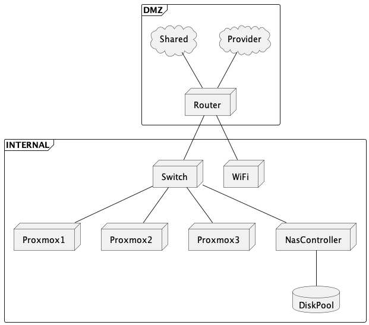

# Homelab

This repository contains the architecture, documentation, configuration and all support files used to design, build and maintain my homelab rack and it's platform.

## Table of contents

- [Homelab](#homelab)
  - [Table of contents](#table-of-contents)
  - [Status Quo](#status-quo)
  - [Concept](#concept)
    - [BoM](#bom)
      - [Rack](#rack)
        - [3D Printed Parts](#3d-printed-parts)
  - [Architecture](#architecture)
    - [Network](#network)

## Status Quo

While my appartment provides a shared fiber-based internet via WiFI, I also have a private provider with the router sitting on my desk.

For this reason I have an OpenWRT custom router connected to the appartment shared WLAN and the private provider via WAN port. This router act as either load balancer and high availability cluster.

Two other gigabit lan ports are connected to the homelab switch and to another router (access point) that serves my wireless network through WiFi 6.

## Concept

The homelab is being designed to be the most affordable possible and consume the least energy, while providing resources to run a Kubernetes cluster along with all services on my home such as NAS, Firewall, DNS, home automation and etc.

The rack is partly 3D printed and can fit a Kallax shelf. The equipment is based on mini pcs, all buyed used, refurbished and upgraded.

### BoM

#### Rack

- Adam Hall 6HE mounting rails (x4) - [Amazon](https://www.amazon.de/gp/product/B00LFSC2BG/ref=ppx_yo_dt_b_asin_title_o02_s00?ie=UTF8&th=1)
- Cable grommet with brush 10 inches - [Amazon](https://www.amazon.de/dp/B08K3FSQLK?psc=1&ref=ppx_yo2ov_dt_b_product_details)
- Blind cover - [Amazon](https://www.amazon.de/dp/B078WBMMRY?psc=1&ref=ppx_yo2ov_dt_b_product_details)

##### 3D Printed Parts

> All parts available under folder `rack/stls`.

- Rack corner (x4 - yellow pla)
- Thinkcentre m700 U1 10 inches server mount (x4 - black pla)
- Netgear support (x1 - black pla) - TBD

## Architecture

### Network

